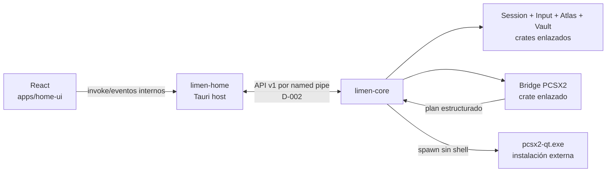
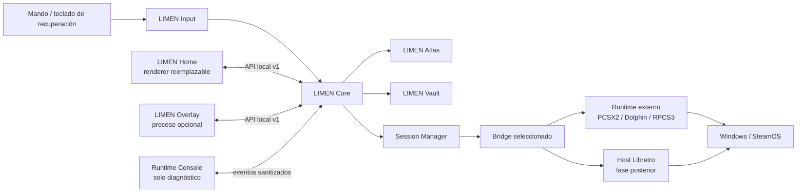
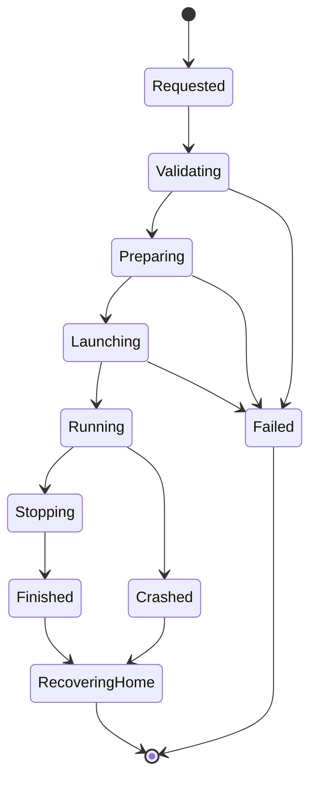
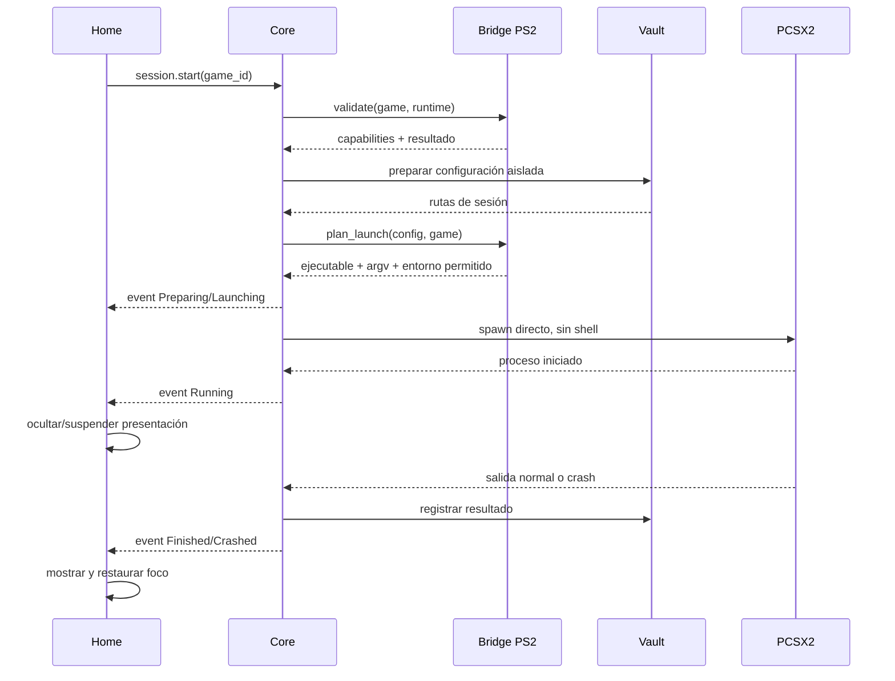

# LIMEN — Arquitectura

Estado: propuesta 0.1; pila A y monorepo aceptados
Regla principal: Home es una piel reemplazable; Core es el producto persistente.

## 1. Invariantes

Estas reglas no dependen de la pila elegida:

1. LIMEN Core no importa ni enlaza código de Home.
2. Home no inicia procesos, no edita configuraciones de runtimes y no accede directamente a juegos o BIOS.
3. Toda comunicación de dominio atraviesa una API local, autenticada y versionada.
4. Un Bridge traduce intenciones; la interfaz nunca conoce argumentos o INI concretos.
5. Los runtimes externos son procesos no confiables y supervisados.
6. Cores Libretro y runtimes externos exponen el mismo modelo de sesión hacia arriba, aunque su control interno sea distinto.
7. Los adaptadores de sistema operativo quedan detrás de interfaces de plataforma.
8. No se ejecutan scripts comunitarios arbitrarios en el proceso de Core.

## 2. Un monorepo no significa un monolito

LIMEN usa un único repositorio para coordinar contratos, aplicaciones y tests, pero entrega varios procesos. Las fronteras de ejecución y de dependencia importan más que la cantidad de repositorios.

### 2.1 Estructura prevista

```text
LIMEN/
├─ apps/
│  ├─ home-ui/                 React + TypeScript
│  ├─ home-host/               ejecutable Tauri y adaptador IPC
│  ├─ overlay/                 futuro ejecutable independiente
│  └─ runtime-console/         futuro cliente de diagnóstico
├─ services/
│  ├─ core/                    ejecutable limen-core
│  └─ libretro-host/           futuro proceso aislado
├─ crates/
│  ├─ domain/                  entidades y reglas puras
│  ├─ contracts/               mensajes API y validación
│  ├─ session/                 máquina de estados
│  ├─ bridge-sdk/              interfaz común de Bridges
│  ├─ bridge-pcsx2/            traducción específica de PCSX2
│  ├─ input/                   acciones, jugadores y puertos
│  ├─ atlas/                   identidad y perfiles
│  ├─ vault/                   guardados, configuración y backups
│  ├─ platform-windows/        GameInput, Win32 y procesos
│  ├─ platform-linux/          SDL3, Wayland/Gamescope y procesos
│  └─ test-support/            fakes y fixtures sin contenido protegido
├─ packages/
│  ├─ client/                  cliente TypeScript generado/validado
│  ├─ ui-kit/                  componentes visuales LIMEN
│  ├─ focus-engine/            navegación espacial controller-first
│  └─ graphics/                escena Three.js/R3F y perfiles de calidad
├─ schemas/v1/                 fuente neutral del contrato local
├─ docs/                       ADR, diseños y pruebas
├─ tools/                      tareas de desarrollo, nunca runtime obligatorio
├─ Cargo.toml                  workspace Rust
└─ pnpm-workspace.yaml         workspace TypeScript
```

Esta es una arquitectura de destino, no una orden para crear carpetas vacías. El primer scaffolding solo materializará lo necesario para M1; las demás piezas aparecerán con su hito.

### 2.2 Qué es proceso y qué es librería

| Pieza | En 0.1 | Dónde vive | Responsabilidad |
|---|---|---|---|
| Home UI | Código dentro del WebView | `apps/home-ui` | Menús DOM, render, foco, animación y estado efímero. |
| Graphics | Paquete enlazado en Home | `packages/graphics` | Escena ambiental Three.js/R3F, calidad adaptativa y fallback raster; nunca contiene acciones esenciales. |
| Home Host | Proceso `limen-home` | `apps/home-host` | Ventana Tauri y puente fino hacia IPC. |
| Core | Proceso `limen-core` | `services/core` | Estado autoritativo, seguridad y orquestación. |
| Domain/Session/Input/Atlas/Vault | Librerías enlazadas en Core | `crates/*` | Responsabilidades internas probables y testeables. |
| Bridge PCSX2 | Librería enlazada en Core | `crates/bridge-pcsx2` | Validar y traducir PCSX2; no dibuja UI. |
| PCSX2 | Proceso externo del usuario | Fuera del repo | Ejecutar el juego de PS2. |
| Overlay | Proceso separado futuro | `apps/overlay` | UI durante el juego; cliente del Core. |
| Host Libretro | Proceso separado futuro | `services/libretro-host` | Alojar cores y contener sus fallos. |
| Runtime Console | Proceso/cliente futuro | `apps/runtime-console` | Observar diagnósticos sanitizados. |

Input, Atlas y Vault son **capas lógicas**, pero no necesitan procesos propios en 0.1. Separarlos prematuramente añadiría IPC y fallos sin aportar aislamiento útil. Sus APIs internas permitirán extraerlos más adelante si aparece una razón concreta.

### 2.3 Ejecución en el vertical slice



El usuario abre `limen-home`. El host comprueba si existe una instancia de `limen-core`; si no, inicia una instancia de usuario desacoplada y se conecta. Cerrar Home no debe terminar Core ni PCSX2. Al volver a abrir Home, solicita un snapshot y reconstruye la presentación.

React no abre named pipes. Habla con un adaptador mínimo del host Tauri; ese adaptador reenvía mensajes validados al Core. El contrato de verdad vive en `schemas/v1`/`crates/contracts`, no en los nombres de comandos Tauri.

## 3. Vista general



## 4. Procesos y responsabilidades

### 4.1 LIMEN Core

Servicio local de larga duración y única fuente de verdad. Es responsable de:

- Biblioteca y selecciones persistentes.
- Registro de Bridges y capacidades.
- Estado de dispositivos y jugadores.
- Preparación y supervisión de sesiones.
- Acceso mediado a Atlas y Vault.
- Autorización de operaciones sensibles.
- Eventos, logs y recuperación tras fallos.

Core debe poder arrancar, aceptar peticiones y supervisar una sesión sin que Home exista.

### 4.2 LIMEN Home

Cliente visual a pantalla completa. Contiene:

- Presentación 2D en DOM/CSS y escena 3D ambiental mediante React Three Fiber.
- Motor de foco espacial.
- Rutas, transiciones y sonido de interfaz.
- Adaptación de glifos.
- Modelo local efímero derivado de snapshots y eventos del Core.

No contiene reglas de lanzamiento ni estado autoritativo. Ningún menú, texto o acción necesaria vive dentro del canvas WebGL: el 3D puede degradarse a un fallback estático sin romper el recorrido.

### 4.3 Session Manager

Máquina de estados para una sesión. Solo este componente puede solicitar al adaptador de procesos que inicie o finalice un runtime.



Cada transición persiste un evento mínimo para que Core pueda reconstruir el resultado después de un crash.

### 4.4 LIMEN Bridge

Un Bridge implementa un contrato común:

- `probe_runtime`: encuentra y describe versiones instaladas sin modificarlas.
- `validate`: comprueba contenido, firmware/BIOS, permisos y compatibilidad.
- `capabilities`: declara fullscreen, no-GUI, pausa, estados, capturas, cambio de disco y control en caliente.
- `plan_launch`: genera argumentos como lista, variables permitidas y rutas de configuración.
- `materialize_config`: produce la configuración efectiva en un área controlada por LIMEN.
- `launch`: entrega el plan al Session Manager; no usa un shell.
- `observe`: traduce salida de proceso y archivos conocidos a eventos de sesión.
- `request_stop`: intenta salida ordenada y define la escalada segura.
- `collect_diagnostics`: obtiene solo información necesaria y sanitizable.

El contrato no presupone que todas las capacidades existan. Home y Overlay consultan capacidades y ocultan acciones imposibles.

### 4.5 Host Libretro

Fase posterior. Carga un core como biblioteca y asume vídeo, audio, input y ciclo de ejecución a través de la API Libretro. Se ejecutará en un proceso separado del Core para contener crashes y conflictos de drivers.

Libretro no sustituye los Bridges externos: los sistemas cuyo runtime oficial no ofrezca un core maduro seguirán como procesos supervisados.

### 4.6 LIMEN Input

Convierte estados físicos en acciones canónicas:

```text
dispositivo físico
  → backend Windows GameInput o backend SteamOS/SDL3
  → perfil y dead zones
  → jugador
  → acciones LIMEN
  → Home / Overlay / adaptador de runtime
```

Las acciones de UI (`accept`, `back`, `menu`) se separan de los controles de juego. El servicio mantiene identificadores locales, hotplug, batería y vibración cuando el backend los exponga.

Backends propuestos:

- Windows: GameInput v1 para baja latencia, callbacks, haptics y datos de dispositivo.
- SteamOS/Linux: SDL3 Gamepad como base; integración con Steam Input se evaluará como adaptador adicional.
- Tests: backend virtual determinista.

### 4.7 LIMEN Atlas

Dominio de identidad y perfiles:

- Huellas y metadatos del contenido.
- Asociación entre edición/región y plataforma.
- Perfil recomendado de Bridge.
- Procedencia y confianza de cada dato.
- Overrides locales explícitos.

Atlas no decide lanzar procesos. Entrega datos al Core.

### 4.8 LIMEN Vault

Posee rutas y políticas para:

- Guardados nativos.
- Save states.
- Capturas.
- Configuración global, de plataforma y de juego.
- Backups y rollback.

Vault no presupone sincronización cloud. Un proveedor remoto futuro implementará una interfaz separada y nunca mezclará ajustes dependientes de hardware con partidas por defecto.

### 4.9 Overlay y Runtime Console

Overlay será otro cliente del Core, no un panel incrustado en Home. Necesita adaptadores de ventana específicos para Windows y Gamescope/Wayland y debe sobrevivir a cambios de renderer de Home.

Runtime Console es una herramienta de desarrollo que muestra:

- Estado y versión de módulos.
- Línea temporal de la sesión.
- Plan de lanzamiento redactado.
- Rendimiento y eventos.
- Errores con identificadores exportables.

Nunca se abre automáticamente delante de un usuario normal.

Su primera versión llega en M2, cuando puede observar una sesión simulada y eventos reales del Core. Evoluciona durante M3/M4 con diagnósticos del Bridge, pero permanece de solo lectura salvo comandos de diagnóstico explícitos y auditables.

## 5. Contrato local

El transporte aceptado en **D-002** usa JSON UTF-8 con framing por longitud sobre named pipes en Windows y Unix domain sockets en Linux. Además:

- El contrato tiene versión mayor (`v1`) y versiones de mensaje.
- Hay comandos, consultas, snapshots y eventos.
- Cada petición incluye `request_id`; cada sesión usa `session_id`.
- Los clientes se autentican con un secreto efímero entregado mediante un canal del sistema operativo.
- El transporte solo acepta conexiones locales.
- Los payloads se validan contra esquemas versionados.
- Los eventos incluyen número de secuencia para detectar huecos y solicitar un nuevo snapshot.
- Una versión mayor incompatible falla con un mensaje claro; nunca intenta continuar a ciegas.

Superficie mínima 0.1:

```text
system.get_info
library.get_home_snapshot
input.get_devices
session.start
session.get
session.stop
events.subscribe
```

Home puede usar un adaptador fino dentro de su host de ventana, pero el IPC privado del framework visual no se convierte en la API de Core.

## 6. Datos y configuración

### 6.1 Capas

La configuración efectiva se resuelve en este orden:

```text
valores seguros de LIMEN
  < preferencias globales del usuario
  < perfil de plataforma
  < perfil Atlas del juego
  < override explícito del usuario
  < override efímero de sesión
```

Cada valor conserva su procedencia. La Runtime Console puede explicar por qué ganó un valor.

### 6.2 Persistencia

- SQLite para biblioteca, identidades, sesiones y procedencia de ajustes.
- Archivos en un directorio de datos de aplicación por plataforma.
- Assets y caché separados de datos irremplazables.
- Migraciones transaccionales, numeradas y con backup previo cuando cambie información crítica.
- Nada usa rutas absolutas del equipo dentro del repositorio.

### 6.3 PCSX2 en 0.1

El Bridge PS2 debe fijar una familia de versiones soportadas y comprobarla. Su plan incluirá:

- Ejecutable seleccionado por el usuario.
- Imagen del juego externa al repositorio.
- Configuración LIMEN aislada de la configuración personal de PCSX2.
- Argumentos independientes para `no GUI`, `batch` y `fullscreen`, validados mediante prueba automatizada/manual contra la versión soportada.
- Directorios de guardado y logs conocidos por Vault.

Si PCSX2 intenta mostrar setup, biblioteca o diálogo modal, la prueba falla. No se automatizan clics para esconder una GUI incompatible.

## 7. Seguridad y confianza

### 7.1 Límites

- Home es contenido visual de confianza limitada y no recibe acceso general al sistema.
- Core tiene acceso a datos LIMEN, pero las operaciones sensibles pasan por servicios explícitos.
- Un runtime externo no obtiene más rutas que las necesarias para su sesión cuando el sistema operativo permita restringirlo.
- Las recetas comunitarias son datos no confiables.

### 7.2 Plan de recetas

Una receta futura será un manifiesto declarativo con operaciones permitidas, no un script. Ejemplos de operaciones auditables:

- Verificar versión o hash.
- Descargar desde una URL permitida con hash esperado.
- Extraer un paquete con límites de tamaño y ruta.
- Copiar o parchear archivos dentro de una raíz concedida.
- Registrar un perfil LIMEN.
- Crear y restaurar backup.

Toda ruta se normaliza y debe permanecer dentro de raíces concedidas. No se aceptan escapes `..`, enlaces que salten de raíz ni comandos arbitrarios. Cualquier futuro modo desarrollador que permita código tendrá advertencias y aislamiento distintos.

## 8. Adaptadores de plataforma

Core define puertos para:

- Procesos y grupos de procesos.
- Ventanas, foco y pantalla completa.
- Entrada y dispositivos.
- Enumeración/emparejamiento.
- Energía, batería y suspensión.
- Almacenamiento seguro.
- Notificaciones.
- Overlay/captura.

Implementaciones:

```text
domain/
  ports
platform-windows/
  GameInput, Win32, DeviceWatcher, process jobs
platform-linux/
  SDL3, proc/systemd user, X11/Wayland/Gamescope
```

La organización en monorepo está aceptada en D-008. Las carpetas físicas se crean por hitos para evitar scaffolding vacío; la separación lógica anterior es obligatoria.

## 9. Flujo vertical 0.1



## 10. Fallos esperados

| Fallo | Respuesta |
|---|---|
| Home cae | Core conserva la sesión; Home se reconecta y pide snapshot. |
| Core cae antes del launch | No se inicia el runtime; Home muestra error recuperable. |
| Core cae durante el juego | Al reiniciar, reconcilia PID/identidad de proceso antes de actuar. |
| Runtime cae | Core marca `Crashed`, conserva logs permitidos y devuelve Home. |
| Versión no soportada | Bridge bloquea el launch y explica versiones aceptadas. |
| Falta BIOS/juego | Validación falla antes de ocultar Home. |
| Overlay incompatible | La sesión continúa; Overlay se desactiva. |
| Mando desconectado | Notificación propia; reconexión conserva jugador si es seguro. |

## 11. Verificación arquitectónica

- Tests de contrato ejecutados contra clientes simulados.
- Tests de máquina de estados y recuperación con procesos falsos.
- Golden tests de planes de lanzamiento sin rutas personales.
- Tests de traversal y permisos para recetas antes de habilitarlas.
- Stress de eventos y reconexión de Home.
- Pruebas reales de fullscreen/foco en Windows y, después, Gamescope.
- El benchmark visual se ejecuta separado del proceso Core.

## 12. Referencias técnicas primarias

- [Modelo de procesos de Tauri](https://v2.tauri.app/concept/process-model/)
- [API y desarrollo de cores Libretro](https://docs.libretro.com/development/cores/developing-cores/)
- [Desarrollo de frontends Libretro](https://docs.libretro.com/development/frontends/)
- [Introducción oficial a Microsoft GameInput](https://learn.microsoft.com/en-us/gaming/gdk/docs/features/common/input/overviews/input-overview)
- [SDL3 Gamepad API](https://wiki.libsdl.org/SDL3/CategoryGamepad)
- [Código fuente oficial de PCSX2](https://github.com/PCSX2/pcsx2)
- [Emparejamiento de dispositivos en Windows](https://learn.microsoft.com/en-us/windows/uwp/devices-sensors/pair-devices)
- [Shell Launcher de Windows](https://learn.microsoft.com/en-us/windows/configuration/shell-launcher/)
- [Recomendaciones oficiales para Steam Deck/SteamOS](https://partner.steamgames.com/doc/steamhardware/recommendations)
